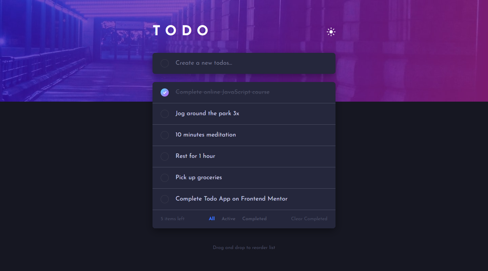
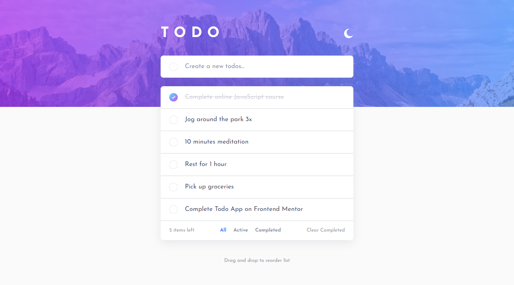

# Frontend Mentor - Draggable Todo app solution

This is a solution to the [Todo app challenge on Frontend Mentor](https://www.frontendmentor.io/challenges/todo-app-Su1_KokOW). Frontend Mentor challenges help you improve your coding skills by building realistic projects. 

## Table of contents

- [Overview](#overview)
  - [The challenge](#the-challenge)
  - [Screenshot](#screenshot)
  - [Links](#links)
- [My process](#my-process)
  - [Built with](#built-with)
  - [What I learned](#what-i-learned)
- [Author](#author)

## Overview

### The challenge

Users should be able to:

- View the optimal layout for the app depending on their device's screen size
- See hover states for all interactive elements on the page
- Add new todos to the list
- Mark todos as complete
- Delete todos from the list
- Filter by all/active/complete todos
- Clear all completed todos
- Toggle light and dark mode
- **Bonus**: Drag and drop to reorder items on the list

### Screenshot

### Links

- Solution URL: [https://github.com/yukilun/todo-app](https://github.com/yukilun/todo-app)
- Live Site URL: [https://yukilun.github.io/todo-app](https://yukilun.github.io/todo-app)

## My process

### Built with

- [Vue.js](https://vuejs.org/) - JS library
- [Pinia](https://pinia.vuejs.org/) - State management library for Vue.js 
- [Tailwind CSS](https://tailwindcss.com/) - CSS framework
- [Vue Draggable](https://github.com/anish2690/vue-draggable-next) - Vue drag-and-drop component

### What I learned

- Transformed existing responsive web design into code
- Utilized Vue + Pinia for state management
- Built theme toggle with Vue + Tailwind CSS
- Used Vue Draggable to allow drag-and-drop for reording items on a list 

## Author

- Website - [Yuki Lun](https://www.yukilun.com)
- Frontend Mentor - [@yukilun](https://www.frontendmentor.io/profile/yukilun)